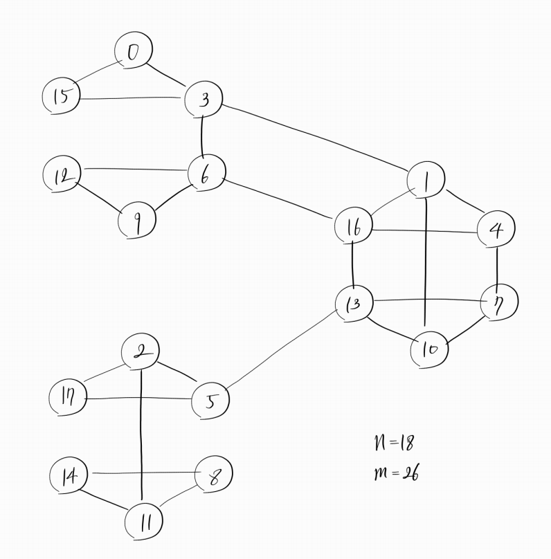

# Girvan-Newman

Undirected, deterministic graph clustering : [K-Garage 홈페이지](https://www.notion.so/Girvan-Newman-algorithm-2004-57802dbde5214442b4140f1353b24737)참고<br/>
Girvan-Newman algorithm의 c++구현. 

### Input description.

First line, integer n,m : each indicates # of nodes, # of edges.
Following m lines, each line consists of i,j,w : edge with weight w connects node i, node j.
(i and j must follow 0-based ordering.)

### Output decription

다음의 3가지 출력 함수를 적절히 수정하여 원하는 형태의 출력을 얻을 수 있음.

```cpp
prt_cut();  // Print sequence of removed edges.
prt_dendrogram();  // Print dendrogram.
prt_cluster();  // Print cluster.
```

### Example

다음과 같은 입력 그래프를 생각해보자. (test_18.txt 의 입력과 같다. test_18.txt는 현재 페이지 가장 아래에 있다.)




```bash
./Girvan_Newman_algorithm < test_18.txt
```

3가지의 출력을 얻는다. 각각 cut sequence, dendrogram, 최대의 modularity를 가질 때 cluster.


<br/>
5개의 cluster일 때 최대의 modularity를 가진다. 찾아진 cluster와 dendrogram모두 직관과 일치한다.

### Reference
Girvan, Michelle, and Mark EJ Newman. "Community structure in social and biological networks." Proceedings of the national academy of sciences 99.12 (2002): 7821-7826.
